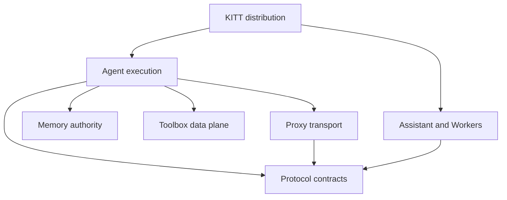

# K.I.T.T. Ecosystem Architecture

This repository is the composition boundary for the K.I.T.T. ecosystem. The architecture uses domain-driven boundaries where they express real ownership and consistency rules; it does not impose ceremonial DDD layers on adapters or infrastructure.

## Bounded contexts

| Module id | Repository | Bounded context | Owns |
| --- | --- | --- | --- |
| `protocol` | `rfdetoni/kitt-protocol` | Shared Contracts | versioned cross-component contracts and SDKs |
| `memory` | `rfdetoni/kitt-memory` | Semantic Memory | durable memory, provenance, retrieval, lifecycle and dream persistence |
| `toolbox` | `rfdetoni/kitt-toolbox` | Native Data Plane | native repository/code intelligence and acceleration |
| `assistant` | `rfdetoni/kitt-assistant` | Resident Assistant | daemon, remote runtime and Control Center lifecycle |
| `agent-cli` | `rfdetoni/kitt-agent-cli` | Agent Execution | task semantics, goals, execution orchestration, approvals and workspace policy |
| `ai-workers` | `rfdetoni/kitt-ai-workers` | Evaluation/AI Workers | evals, evolution and optional heavy workers |
| `reverse-proxy` | `rfdetoni/kitt-reverse-proxy` | Provider Gateway | authorized API/web-provider transport, sessions and provider plugins |

The root `rfdetoni/kitt` repository owns installation, dependency resolution and cross-repository compatibility validation. It composes the current `main` branches by default and must not become a shared source-code dumping ground.

## Context map

The distribution resolves each selected repository's `main` to a per-run SHA.

Arrows are collaboration/dependency relationships, not permission to import sibling internals.

## Agent Engineering ownership in 0.11.0

The Agent Engineering contracts introduced by Protocol 0.5 are intentionally
cross-language value contracts, not new shared runtime authorities:

| Contract / concern | Runtime owner | Notes |
| --- | --- | --- |
| `AgentEvent`, replayable run state | Agent CLI | persisted by the Agent EventLedger; Assistant transports events only |
| `PlanProposal`, `HostExecutionState`, `SubagentReport` | Agent CLI | Protocol 0.7 defines shapes; Agent owns DAG readiness, host evidence and child lifecycle; Proxy consumes facts only |
| `AgentRole` enforcement | Agent CLI | structural capabilities/tools/mutation/context/model/budget policy; prompt persona is not authority |
| managed process identity/lifecycle | Agent CLI runtime/tool registry | `process.start/read/stdin/signal/stop/resume`; control revalidates captured authority and output/exit enter the EventLedger |
| `ExecutionBudget`, `BudgetLease`, `AgentLineage` | Agent CLI | one parent wallet; child workers consume leased slices |
| `ExecutionAuthoritySnapshot`, `SavedPermission` | Agent CLI | policy/approval authority; Assistant forwards daemon identity only |
| `ContextEpoch`, `CompactionCheckpoint`, recovery refs | Agent CLI | exact bytes remain in Agent ArtifactStore; Protocol defines shape |
| `WorkspaceSnapshot` | Agent CLI | captured/restored under Agent workspace mutation fencing |
| `RecallTrace`, `MemoryConsumptionReceipt`, `MemoryJob` | Memory | kitt-memoryd remains the only durable semantic-memory authority |
| public memory lifecycle evidence | Memory | digest-only `session.started` / `turn.started` / `tool.completed` / `turn.completed` / `session.ended` ingress feeds the same MemoryJob pipeline; no parallel Agent store |
| Task Episode efficiency and learning candidates | Agent CLI + AI Workers | Agent records evidence; Workers/Evals evaluate candidates; no silent live auto-apply |
| `kitt learn` portfolio/experiment frontend | Agent CLI | exposes sanitized local evidence and control/candidate measurements; never auto-promotes a candidate |
| `PluginCapabilities` | Plugin host (Agent) | declarations narrow exports; host permissions remain authority |

A companion may cache or transport one of these values, but it must not create a
second durable source of truth for the same lifecycle.

Provider transport follows the same one-authority rule: Agent CLI emits typed
`kitt_context`, native tool schemas and Protocol `KittRequestMetadata` as `kitt_meta`; Reverse Proxy lowers those
contracts for WebChat without reparsing generated prompt headings. Agent CLI 0.82.0 requires conversation, turn and route identity at the execution boundary, while Reverse Proxy 4.8.0 validates and transports that metadata without making it provider-visible. The legacy
`[KITT TURN CONTEXT]` / textual `Tool Contract:` path is intentionally removed
from the current ecosystem rather than maintained as a second semantic channel.

## Strategic rules

1. **One authority per concept.** Conversation execution belongs to Agent; durable semantic memory belongs to Memory; provider transport belongs to Reverse Proxy.
2. **Contracts over shared internals.** Cross-context data moves through `kitt-protocol` or an explicitly versioned public interface.
3. **Dependencies are directional.** A context can depend on a contract or companion without taking ownership of its implementation.
4. **Infrastructure stays infrastructure.** HTTP clients, SQLite adapters, TUI renderers, browser automation and native bridges are not domain entities merely because DDD is used elsewhere.
5. **Aggregates require consistency boundaries.** Use aggregate-like modeling only when a set of state changes must preserve one invariant/transactional lifecycle.
6. **Composition follows main.** The root installer resolves every selected K.I.T.T. repository from `main` by default; explicit tags/SHAs are opt-in diagnostic overrides.
7. **Fallback preserves behavior.** Optional native or resident components may accelerate/enrich behavior but may not silently change security semantics.
8. **CI snapshots are ephemeral.** Cross-repository CI resolves moving refs to concrete SHAs once at the start of a run so that run is internally consistent. Those SHAs are evidence for that run, not a persistent ecosystem lock.

## Compatibility invariants

A promotion must preserve or intentionally version:

- protocol and wire schemas;
- model-facing Agent runtime contracts;
- memory ownership/lifecycle semantics;
- installer dependency closure;
- Python namespace composition;
- platform support declared by the catalog;
- provider-gateway contracts used by the Agent;
- native fallback semantics.

If a change crosses more than one bounded context, prefer a staged compatibility window: add compatible contract support first, promote both sides, then remove the old contract in a later release.

## Tactical DDD guidance

Use value objects for identity/configuration with stable invariants. Use domain services for domain rules that do not belong to one entity. Introduce repository abstractions only when domain/application code genuinely needs persistence independence.

Do **not** introduce a generic `domain/application/infrastructure` folder hierarchy into every repository by policy. Each repository should express the same dependency direction using its native language and existing structure.

## Governance

`scripts/validate_architecture.py` validates the catalog dependency graph and checks that every catalog repository is represented in this document. CI runs it together with the main-first ecosystem validation.

This guard intentionally checks high-value ownership/dependency invariants rather than cosmetic package names.

## Gateway lifecycle in distribution 0.12.0

Agent owns the execution wallet, privacy decisions, task identity, approvals and
tool execution. Protocol owns shared wire contracts and the authoritative context
schema. Proxy owns browser/session transport, repair attempts, cancellation,
stream framing and transport idempotency. Memory owns durable mutation receipts;
Toolbox owns native file snapshots and byte cursors. Assistant and Workers reuse
Agent policy rather than constructing separate privacy or approval authorities.

Agent reserves attempts and input allowance before dispatch. Proxy consumes that
grant across every repair under a single session lease and deadline. Context
acknowledgements commit only after a successful response; session reset invalidates
them. Context and repair evidence remain untrusted data beneath the English
system policy. A pending or submitted-uncertain request cannot be silently evicted
and replayed. Cancellation terminates transport work; it cannot undo provider work
already submitted.

Main installation records the actual per-run repository SHAs. CI checks the
Protocol/Proxy generated schema at those same revisions. The release evidence is
a historical snapshot, not a persistent ecosystem lock or an exactly-once promise.
